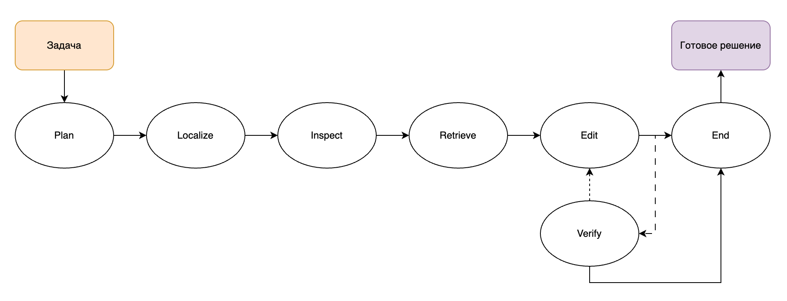

# AgenticCodeRAG

Repository-aware agent for code completion and bug fixing.

**Stack**: DraCo (context graph) + SCIP (optional symbol navigation) + LangGraph (agent) + RepoExec / SWE-bench Verified (evaluation)

---

## Architecture



---

## Setup

### 1. Install the package

```bash
pip install -e .
# with SCIP support:
pip install -e ".[scip]"
# with dev tools:
pip install -e ".[dev]"
```

### 2. Clone vendor repos

```bash
bash scripts/setup_deps.sh
```

This clones into `vendor/`:
- `vendor/DraCo` — context graph engine
- `vendor/RepoExec` — RepoExec execution eval (also extracts `test-apps.zip` and builds the `codeeval-runner` Docker image)
- `vendor/SWE-bench` — SWE-bench harness

### 3. Configure environment

```bash
cp .env.example .env
# fill in the relevant API keys
```

| Variable | Purpose |
|---|---|
| `ANTHROPIC_API_KEY` | Anthropic Claude API key |
| `OPENAI_API_KEY` | OpenAI API key |
| `OPENAI_COMPATIBLE_API_KEY` | Key for OpenAI-compatible server |
| `HTTPS_PROXY` | Optional HTTP/HTTPS proxy |
| `SSL_CERT_FILE` | Optional custom CA bundle for TLS verification |
| `DRACO_DIR` | Override path to DraCo repo (default: `vendor/DraCo`) |

### 4. Download benchmark datasets

```bash
bash scripts/download_data.sh
```

Pre-fetches into the HuggingFace cache:
- **RepoExec** — `Fsoft-AIC/RepoExec`
- **SWE-bench Verified** — `SWE-bench/SWE-bench_Verified`

#### SWE-bench Docker images (for harness-based eval only)

Required only when using `--run_harness`:

```bash
bash scripts/pull_swebench_images.sh
```

---

## Building the index

```python
from agentic_code_rag.draco_wrapper import DraCoIndex

index = DraCoIndex("/path/to/your/repo")
index.build()          # runs DraCo preprocess.py, saves graph.json
index.save_json()      # optional: export to JSON for inspection
```

The graph is cached in `<repo>/.draco_graph/graph.json`. Subsequent calls to `build()` load from cache unless `force=True`.

### Optional: SCIP symbol navigation

For precise `goto_definition` / `find_references` on Python or TypeScript repos:

```bash
# Python
pip install scip-python
scip-python index . --output index.scip

# TypeScript/JavaScript
npm install -g @sourcegraph/scip-typescript
scip-typescript index --output index.scip
```

```python
from agentic_code_rag.scip_nav import SCIPNavigator

nav = SCIPNavigator("/path/to/repo")
nav.load_index("index.scip")
loc = nav.goto_definition("my_function")
```

---

## Running the agent

```python
from agentic_code_rag.draco_wrapper import DraCoIndex, DraCoToolAPI
from agentic_code_rag.agent import build_agent_graph, AgentState
from agentic_code_rag.agent.llm_provider import create_llm

# Anthropic (api_key read from ANTHROPIC_API_KEY env)
llm = create_llm("anthropic", "claude-sonnet-4-6",
                 base_url="https://api.anthropic.com")

# OpenAI (api_key read from OPENAI_API_KEY env)
llm = create_llm("openai", "gpt-4o")

# OpenAI-compatible (including local e.g. ollama, vLLM)
# (api_key read from OPENAI_COMPATIBLE_API_KEY env)
llm = create_llm("openai_compatible", "qwen2.5-coder:0.5b",
                 base_url="http://localhost:11434/v1")

index = DraCoIndex("/path/to/repo")
index.build()
tool_api = DraCoToolAPI(index, "/path/to/repo")

agent = build_agent_graph(tool_api, llm, trajectory_dir="results/trajectories")

state = AgentState(
    task_text="Fix the bug where division by zero occurs in calculate_average()",
    repo_root="/path/to/repo",
    snapshot_id="my_repo",
)
result = agent.invoke(state)
print(result["proposed_patch"])
```

---

## Benchmarks

Every runner script accepts an optional `--setup` argument that points to one of the
`configs/setup_*.yaml` files. When provided, the YAML controls:

- **`enabled_tools`** — whitelist of tools the agent may call (missing tools return an error).
- **`agent.max_retries`**, **`agent.max_tool_calls_per_phase`**, **`agent.max_total_tool_calls`** — resource limits.

If `--setup` is omitted, all tools are enabled and default limits apply.

Both runners build a fresh `DraCoIndex` + `DraCoToolAPI` + `agent_graph` **per task** against the actual target repository, so the agent's `repo_tree` / `grep_search` / `symbol_search` only see code from that repo.

### RepoExec

The target project for each task lives in `vendor/RepoExec/test-apps/<project>/` after `setup_deps.sh` extracts `test-apps.zip`.

```bash
python scripts/run_repoexec.py \
  --provider openai_compatible \
  --model claude-sonnet-4-6 \
  --base_url https://api.anthropic.com \
  --context_level small_context \
  --output results/repoexec \
  --setup configs/setup_5_full_agent.yaml
```

Pipeline: generate → `generations.json` → `process_result.py` → Docker `codeeval-runner` → `passk.py` → pass@k.

### SWE-bench Verified

For each instance, the script clones `https://github.com/<repo_name>.git` into `--repo_cache` (default `/tmp/swebench_repos/<instance_id>`) and runs the agent against it.

```bash
python scripts/run_swebench.py \
  --provider openai_compatible \
  --model claude-sonnet-4-6 \
  --base_url https://api.anthropic.com \
  --output results/swebench \
  --setup configs/setup_5_full_agent.yaml
  # add --run_harness to invoke the official Docker evaluation
  # (requires: bash scripts/pull_swebench_images.sh)
```

---

## Experiment setups

Configs are in `configs/setup_*.yaml`. Pass any config to any runner with `--setup`.

| Config | `mode` | Description |
|---|---|---|
| `setup_0_zero_shot` | `zero_shot` | Raw prompt to LLM, no retrieval, no tools |
| `setup_1_static_rag` | `static_rag` | BM25 + DraCo context prepended to prompt, single LLM call |
| `setup_2_no_index_agent` | `agent` | Agent with basic file navigation only (`open_file`, `grep_search`) |
| `setup_3_bm25_agent` | `agent` | Agent with file navigation + BM25 keyword search |
| `setup_4_bm25_vector_agent` | `agent` | Agent with file navigation + BM25 + vector semantic search |
| `setup_5_full_agent` | `agent` | Full agent: all tools (DraCo graph + BM25 + vector), no retries |
| `setup_6_full_agent_retry` | `agent` | Full agent: all tools + verify/retry loop (up to 3 retries) |

### How modes work

**`mode: zero_shot`** — The runner calls the LLM once with the raw benchmark prompt. No index, no retrieval, no agent loop.

**`mode: static_rag`** — The runner retrieves context *in code* (BM25 top-k + DraCo `retrieve_context_for_task`), prepends it to the prompt, and calls the LLM once. Controlled by `retrieval.bm25_top_k` and `retrieval.token_budget` in the YAML.

**`mode: agent`** (default) — The LangGraph StateGraph runs. Tools listed in `enabled_tools` are the only ones available to the agent; the system prompt is generated dynamically to mention only those tools.

---

## Results

**RepoExec** — 355 tasks, 23 Python repos, pass@1, model: Qwen3-Coder-480B-A35B.

Full experiment results are available here: [Yandex Disk](https://disk.yandex.ru/d/ahOMv3kItlUfgw)

| Setup | small context | medium context | full context |
|---|---|---|---|
| `setup_0_zero_shot` | 43.42% | 43.86% | 47.81% |
| `setup_1_static_rag` | 46.05% | 44.74% | 48.25% |
| `setup_2_no_index_agent` | 50.44% | 50.44% | 49.12% |
| `setup_3_bm25_agent` | **52.19%** | 49.56% | 51.75% |
| `setup_4_bm25_vector_agent` | 51.32% | **50.44%** | 46.49% |
| `setup_5_full_agent` | **52.19%** | 49.56% | 50.00% |
| `setup_6_full_agent_retry` | **52.19%** | 49.56% | **52.19%** |

Context levels are defined by the RepoExec benchmark: `small` — function signature only; `medium` — signature + neighbouring functions; `full` — full file content.

---

## Running tests

```bash
pip install -e ".[dev]"
pytest tests/ -v
```

---

## Project structure

```
src/agentic_code_rag/
  draco_wrapper/
    index.py          DraCoIndex — loads and queries the context graph
    tools.py          DraCoToolAPI — all agent tools
  scip_nav/
    navigator.py      SCIPNavigator — optional precise symbol navigation
  agent/
    state.py          AgentState dataclass
    graph.py          LangGraph StateGraph
    llm_provider.py   create_llm()
  benchmarks/
    repoexec.py       RepoExec runner
    swebench.py       SWE-bench Verified runner
  eval/
    metrics.py        pass@k, EM, ES, CodeBLEU helpers

configs/              Experiment setup YAMLs (setup_0 ... setup_6)
scripts/              CLI entrypoints (run_repoexec.py, run_swebench.py)
vendor/               Cloned external repos (DraCo, RepoExec, SWE-bench)
results/              Output — predictions, summaries, trajectories
```
